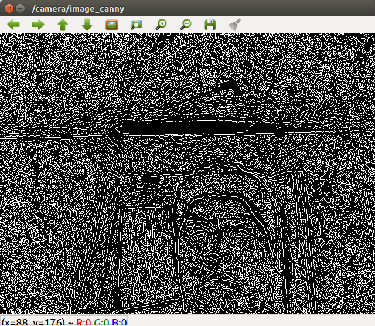

# Camera Edge Ros
compute canny edge detector in images using ros

**Author: Agustin Ortega aortega@gmail.com**

## Overview
this project was tested using ROs kinect

## Dependences
- ros kinect
- opencv 3
- catkin

## Building and installing

    cd catkin_workspace/src
    git clone https://github.com/agusorte/canny_edge_ros

    cd ../
    catkin_make

## Running

    roslaunch canny_edge_my_face canny_edge_my_face.launch

## Nodes
- canny_edge_my_face_node
- cv_camera_node

## Results

